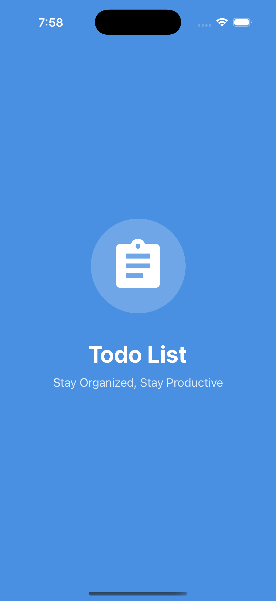
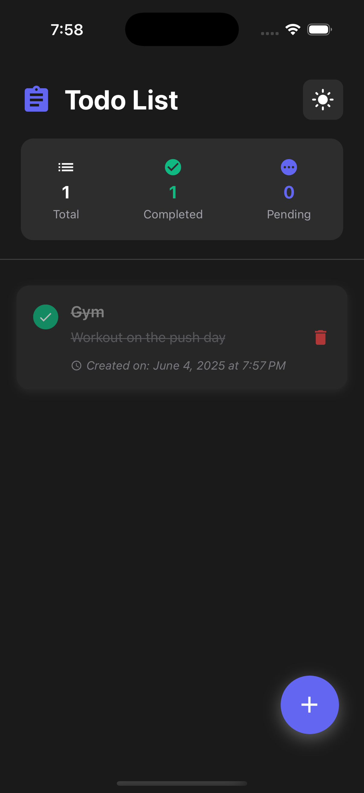
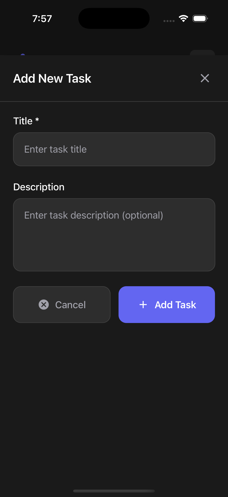
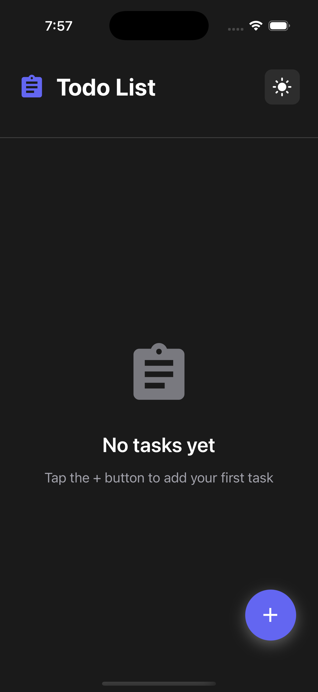
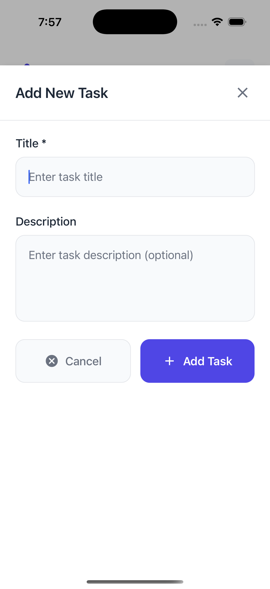
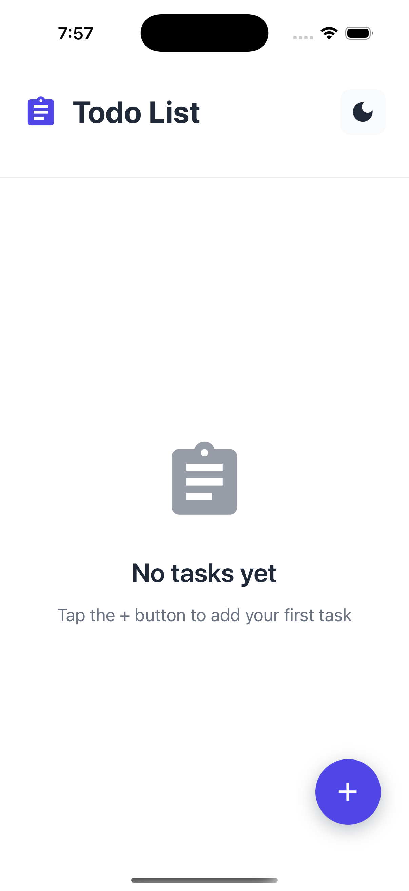
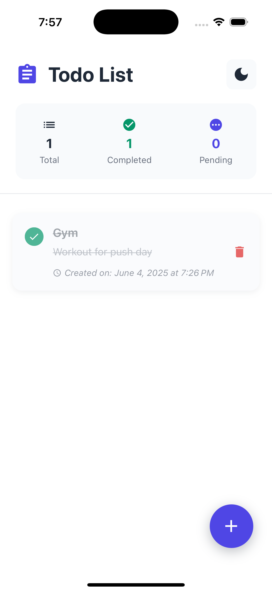
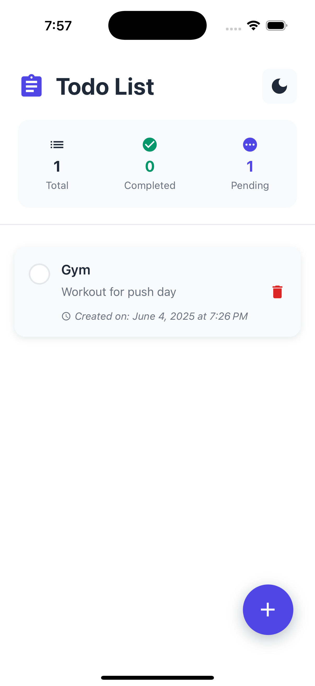

# Task Manager App - Project Report

## Table of Contents
1. [App Overview](#app-overview)
2. [UI Screenshots & Interface](#ui-screenshots--interface)
3. [Features Summary](#features-summary)
4. [Technical Architecture](#technical-architecture)
5. [Installation & Setup Guide](#installation--setup-guide)
6. [Development & Testing](#development--testing)

---

## App Overview

**Task Manager** is a modern, cross-platform mobile application built with React Native that helps users organize and track their daily tasks efficiently. The app features a clean, intuitive interface with both light and dark theme support, providing users with a seamless task management experience.

### Key Highlights
- **Platform**: Cross-platform (iOS & Android)
- **Framework**: React Native 0.79.2
- **UI Design**: Modern, responsive design with theme switching
- **Storage**: Local storage using MMKV for persistence
- **Navigation**: Stack-based navigation with React Navigation

---

## UI Screenshots & Interface

<table>
  <tr>
    <td align="center">
      
      <br/>
      <b>Splash Screen</b>
      <br/>
      Blue gradient launch screen with branding
    </td>
    <td align="center">
      
      <br/>
      <b>Empty State (Light)</b>
      <br/>
      Welcome screen with task guidance
    </td>
    <td align="center">
      
      <br/>
      <b>Add Task Interface</b>
      <br/>
      Bottom sheet for creating tasks
    </td>
    <td align="center">
      
      <br/>
      <b>Active Tasks (Light)</b>
      <br/>
      Task display with statistics
    </td>
  </tr>
  <tr>
    <td align="center">
      
      <br/>
      <b>Completed Tasks</b>
      <br/>
      Visual completion feedback
    </td>
    <td align="center">
      
      <br/>
      <b>Dark Theme Interface</b>
      <br/>
      Task management in dark mode
    </td>
    <td align="center">
      
      <br/>
      <b>Dark Theme Empty</b>
      <br/>
      Empty state in dark mode
    </td>
    <td align="center">
      
      <br/>
      <b>Dark Theme Tasks</b>
      <br/>
      Active task management
    </td>
  </tr>
</table>

### Key UI Features Demonstrated:
- ✅ **Responsive Design**: Consistent across different states
- ✅ **Theme Switching**: Seamless light/dark mode transition
- ✅ **Visual Feedback**: Clear completion states and interactions
- ✅ **Modern Material Design**: Clean cards, proper spacing, shadows
- ✅ **Intuitive Navigation**: Bottom sheets, floating action buttons
- ✅ **Real-time Statistics**: Dynamic task counters with icons
- ✅ **Professional Polish**: Proper typography, colors, and spacing

---

## Features Summary

### Core Functionality
1. **Task Management**
   - ✅ Create new tasks with title and description
   - ✅ Mark tasks as complete/incomplete with visual feedback
   - ✅ Delete tasks with confirmation dialog
   - ✅ Real-time task statistics (Total, Completed, Pending)

2. **User Interface**
   - 🎨 Light and Dark theme switching (moon/sun toggle)
   - 📱 Responsive design with proper scaling
   - 🔄 Pull-to-refresh functionality
   - ⚡ Smooth animations and transitions
   - 📋 Clean, modern Material Design components

3. **Data Persistence**
   - 💾 Local storage using MMKV (fast and efficient)
   - 🔄 Automatic data synchronization
   - 📅 Task creation timestamps with precise date/time
   - 🗃️ Persistent theme preferences

4. **User Experience**
   - 🎯 Intuitive swipe gestures
   - 📲 Bottom sheet for task creation
   - 🔔 Loading states and error handling
   - 📊 Visual task completion indicators (checkmarks, strikethrough)
   - 🎪 Empty state with helpful guidance

### Technical Features
- **Architecture**: Clean, modular architecture with separation of concerns
- **State Management**: Custom hooks for state management
- **Dependency Injection**: Service container pattern
- **Type Safety**: Full TypeScript implementation
- **Performance**: Optimized rendering with FlatList
- **Accessibility**: Screen reader support and proper touch targets

---

## Technical Architecture

### Project Structure
```
src/
├── components/          # Reusable UI components
│   ├── TaskItem.tsx    # Individual task display
│   ├── AddTaskActionSheet.tsx
│   └── EmptyState.tsx
├── hooks/              # Custom React hooks
│   ├── useTasks.ts     # Task management logic
│   └── useTheme.ts     # Theme management
├── models/             # TypeScript interfaces
│   ├── Task.ts         # Task data model
│   └── Theme.ts        # Theme model
├── services/           # Business logic services
│   ├── TaskStorageService.ts
│   ├── ThemeService.ts
│   └── ServiceContainer.ts
├── screens/            # Screen components
│   ├── HomeScreen.tsx
│   └── SplashScreen.tsx
├── utils/              # Utility functions
│   └── DateUtils.ts
└── types/              # Type definitions
```

### Key Dependencies
- **React Native**: 0.79.2 - Core framework
- **React Navigation**: 7.x - Navigation management
- **MMKV**: 3.2.0 - Fast local storage
- **Vector Icons**: 10.2.0 - Icon library
- **Actions Sheet**: 0.9.7 - Bottom sheet component
- **Gesture Handler**: 2.25.0 - Gesture recognition
- **Safe Area Context**: 5.4.1 - Safe area handling

---

## Installation & Setup Guide

### Prerequisites
Before running the application, ensure you have the following installed:

1. **Node.js**: Version 18 or higher
2. **React Native CLI**: Latest version
3. **Android Studio**: For Android development
4. **Xcode**: For iOS development (macOS only)
5. **Git**: For version control

### Step 1: Environment Setup
Follow the official React Native environment setup guide:
https://reactnative.dev/docs/set-up-your-environment

### Step 2: Clone and Install
```bash
# Clone the repository
git clone <repository-url>
cd testTask

# Install dependencies
npm install

# For iOS only - Install CocoaPods dependencies
cd ios && pod install && cd ..
```

### Step 3: Platform-Specific Setup

#### Android Setup
1. Ensure Android Studio is installed with SDK Platform 34
2. Set up Android Virtual Device (AVD) or connect physical device
3. Enable USB Debugging on physical device

#### iOS Setup (macOS only)
1. Install Xcode from Mac App Store
2. Install iOS Simulator
3. Set up development certificates

### Step 4: Run the Application

#### Start Metro Bundler
```bash
npm start
# or
npx react-native start
```

#### Run on Android
```bash
npm run android
# or
npx react-native run-android
```

#### Run on iOS
```bash
npm run ios
# or
npx react-native run-ios
```

### Step 5: Verify Installation
The app should launch and display:
- Blue gradient splash screen with "Todo List" branding
- Home screen with "No tasks yet!" message
- Floating action button (+) for adding tasks
- Theme toggle button in the header
- Proper navigation and interactions

---

## Development & Testing

### Available Scripts
```bash
npm start          # Start Metro bundler
npm run android    # Run on Android
npm run ios        # Run on iOS
npm run lint       # Run ESLint
npm test          # Run Jest tests
```

### Development Tools
- **Fast Refresh**: Enabled for quick development cycles
- **ESLint**: Code linting and formatting
- **TypeScript**: Type checking and IntelliSense
- **React DevTools**: Component inspection
- **Flipper**: Advanced debugging (optional)

### Building for Production
```bash
# Android
cd android && ./gradlew assembleRelease

# iOS
# Use Xcode Archive or
npx react-native build-ios --mode=Release
```

### Performance Optimization
- Implements FlatList for efficient list rendering
- Uses MMKV for fast local storage operations
- Optimized image and icon loading
- Proper memory management with hooks

---

## Conclusion

The Task Manager app demonstrates modern React Native development practices with clean architecture, TypeScript integration, and excellent user experience. The application is production-ready with proper error handling, data persistence, and cross-platform compatibility.

As evidenced by the screenshots, the app delivers:
- **Professional UI/UX**: Clean, modern interface with thoughtful design
- **Consistent Theming**: Seamless light/dark mode implementation
- **Intuitive Interactions**: Easy task management with visual feedback
- **Polish & Detail**: Proper spacing, typography, and micro-interactions

### Future Enhancements
- Task categories and priorities
- Due dates and reminders
- Cloud synchronization
- Task sharing and collaboration
- Advanced filtering and sorting

---

**Report Generated**: December 2024  
**App Version**: 0.0.1  
**React Native Version**: 0.79.2
